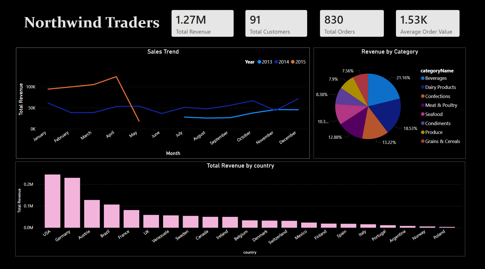

# 📊 Northwind Traders Business Intelligence Dashboard

## 📌 Overview
This project analyzes sales, customers, products, shipping, and employee performance using Power BI to generate actionable business insights and improve decision-making.

---

## 🚀 Features
- 💰 Revenue Analysis
- 👥 Customer Insights
- 📦 Product Performance
- 🚚 Shipping Analytics
- 🧑‍💼 Employee Performance Tracking
- 📈 Interactive Visualizations
- 🎯 Business Recommendations

---

## 🌐 Power BI Report
🔗 [View Interactive Dashboard](https://app.powerbi.com/view?r=eyJrIjoiNzYxNjdlOGYtOWExZi00YjQzLWE5NmYtNGIxZDAzNTdmNWRmIiwidCI6ImNiNmMxMjcwLWVjNmItNDI1Mi1iNzcwLWFkMDQ1NDQxOTgzZCJ9&pageName=72de64e6327a1d2e0893)

---

## 🛠️ Tools Used
- 📊 Power BI
- ⚡ DAX
- 🗂️ CSV Dataset
- 📑 Data Modeling
- 📈 Data Visualization

---

## 🗃️ Dataset
📌 Northwind Traders Dataset

---

## 📷 Dashboard Screenshots

<table>
<tr>
<td align="center"><b>📊 Executive Overview</b></td>
<td align="center"><b>📦 Product Analysis</b></td>
</tr>

<tr>
<td></td>
<td></td>
</tr>

<tr>
<td align="center"><b>👥 Customer Analysis</b></td>
<td align="center"><b>🚚 Shipping & Employee Analysis</b></td>
</tr>

<tr>
<td></td>
<td></td>
</tr>

</table>

---

## 🔍 Key Insights
- 🥤 Beverages category generated the highest revenue contribution.
- 🌍 Germany and USA contributed major sales volume.
- 🚚 Shipping performance varied across shipping providers.
- 👑 A small group of customers contributed significantly to total revenue.
- 📈 Employee sales performance showed noticeable variations.

---

## 🎯 Business Recommendations
- 🚀 Focus marketing efforts on high-performing regions.
- 📦 Optimize inventory for top-selling product categories.
- 🤝 Improve customer retention strategies for high-value customers.
- 🚚 Enhance logistics efficiency to reduce shipping delays.

---

⭐ If you found this project useful, feel free to star the repository!
